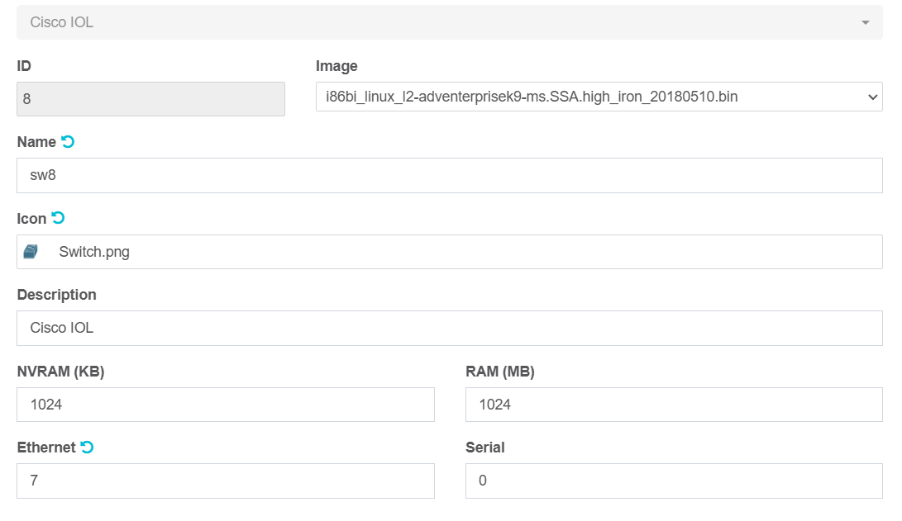
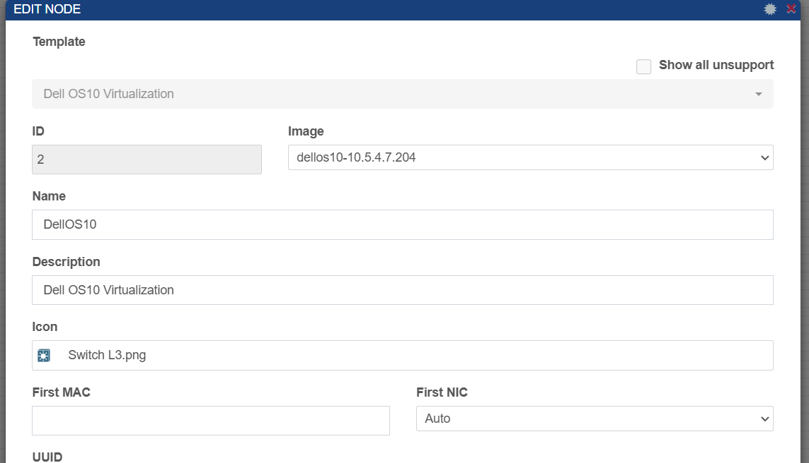
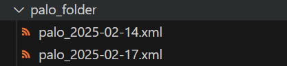

# Ansible-Backup


## Table of Contents
- [Introduction](#introduction)  
- [Topology](#topology)  
- [Steps](#steps)  
- [Device IP Address Table](#device-ip-address-table)  
- [Hosts Inventory](#hosts-inventory)  
- [Cisco Routers / Switches](#cisco-routers--switches)  
- [Dell](#dell)  


## Introduction
I'm developing an Ansible-based backup automation project for firewalls (Fortinet, Palo Alto, F5) and network devices (Cisco switches and routers). The project includes a web interface to manage and monitor the automation process. Initially, I'm using PNetLab for simulation, with plans to transition to real-world scenarios for deployment and testing.


## Topology 


## Steps

### 🔹 **Phase 1: Environment Setup**  
- [ ] Set up **PNetLab** with firewall and network device images  
- [ ] Install **Ansible** and required dependencies  
- [ ] Configure SSH & API access for devices  
- [ ] Define Ansible inventory for network devices  

### 🔹 **Phase 2: Backup Automation**  
- [ ] Create Ansible playbooks for:  
  - [ ] **Fortinet** backup  
  - [ ] **Palo Alto** backup  
  - [ ] **Cisco switches/routers** backup
  - [ ] **Dell switches/routers** backup
  - [ ] **F5** backup  
- [ ] Implement a  FTP  solution  
- [ ] Schedule automated backups

### 🔹 **Phase 3: Web Interface Development**  
- [ ] Design a **dashboard** for backup management  

### 🔹 **Phase 4: Testing & Real-World Deployment**  
- [ ] Validate automation in **PNetLab**  
- [ ] Deploy to real devices in a **test environment**


## Device IP Address Table  

| Device Type   | Vendor     | Hostname     | IP Address     |
|--------------|-----------|-------------|--------------|
| Firewall     | Fortinet   | FW1  | 192.168.11.66  |
| Firewall     | Palo Alto  | PA-VM-1      | 192.168.11.160  |
| Firewall     | F5         | F5-LTM-1     |   |
| Switch       | Cisco      | SW-Core-1    | 192.168.11.28 |
| Router       | Cisco      | R1           | 192.168.11.25 |
| Router       | Cisco      | R2           | 192.168.11.26 |
| Server      | Ubuntu      | Control node           | 192.168.11.100 |
| Server      | Ubuntu      |  SFTP         |  |


## Hosts inventory 
 

### **📂** Playbook Location: `playbooks/hosts`**  

```ini

[routers]
R1 ansible_host=192.168.11.25
R2 ansible_host=192.168.11.26
[routers:vars]
ansible_user=souhail
ansible_password=123
ansible_connection=network_cli
ansible_network_os=ios


[switches]
SW2  ansible_host=192.168.11.28
[switches:vars]
ansible_user=souhail
ansible_password=123
ansible_connection=network_cli
ansible_network_os=ios


[fortigates]
fgt ansible_host=192.168.11.66 ansible_user=admin ansible_password=ertdfgcvb

[fortigates:vars]
ansible_network_os=fortinet.fortios.fortios
[all:vars]

ansible_connection=httpapi

ansible_httpapi_validate_certs=no

ansible_httpapi_use_ssl=no


[dell]
DEll1 ansible_host=192.168.11.152 ansible_net_os_name=dellos10

[dell:vars]
ansible_connection= ansible.netcommon.network_cli
ansible_network_os= dellemc.os10.os101
ansible_user= admin
ansible_password= ertdfgcvb
ansible_become= true
ansible_become_method= enable
ansible_become_password= !vault...

[paloAltos]
palo ansible_host=192.168.11.160

[paloAltos:vars]
ansible_connection=local
os=panos


```

##  Cisco Routers / switches
### Router model

### switch model



### **📂** Playbook Location: `playbooks/cisco.yml`**  
```yaml
---
- name: General Config for Routers
  hosts: routers
  gather_facts: true  
  vars:
    hostname: "{{ inventory_hostname }}"
  tasks:
    # - name: Add Banner
    #   cisco.ios.ios_banner:
    #     banner: login
    #     text: |
    #       Wasssssssssssuuuuuuuuuup
    #     state: present

    - name: Get timestamp
      command: date +%Y-%m-%d
      register: timestamp

    - name: Configurable backup path
      cisco.ios.ios_config:
        src: ios_template.j2
        backup: true
        backup_options:
          filename: "{{ inventory_hostname }}_{{ timestamp.stdout }}.cfg"
          dir_path: "/etc/ansible/cisco_folder/RT"

- name: General Config for Switches
  hosts: switches
  gather_facts: yes 
  vars:
    hostname: "{{ inventory_hostname }}"
  tasks:
    # - name: Add Banner
    #   cisco.ios.ios_banner:
    #     banner: login
    #     text: |
    #       Wasssssssssssuuuuuuuuuup
    #     state: present
    
    - name: Get timestamp
      command: date +%Y-%m-%d
      register: timestamp

    - name: Configurable backup path
      cisco.ios.ios_config:
        src: ios_template.j2
        backup: true
        backup_options:
          filename: "{{ inventory_hostname }}_{{ timestamp.stdout }}.cfg"
          dir_path: "/etc/ansible/cisco_folder/SW"

```

##  Dell

### dell model



### **📂** Playbook Location: `playbooks/dell.yml`**  
```yaml
---
- name: Backup Dell OS10 Switch Configuration
  hosts: dell  
  gather_facts: yes 

  tasks:
    - name: Backup current switch config (dellos10)
      dellemc.os10.os10_config:
        backup: yes
        backup_options:
          dir_path: "/etc/ansible/dell_folder"
          filename: "{{ inventory_hostname }}_{{ ansible_date_time.date }}.cfg"
      register: backup_dellos10_location
      when: ansible_network_os == 'dellemc.os10.os10'

    - name: Display backup location
      debug:
        msg: "Backup stored at {{ backup_dellos10_location.backup_path }}"
      when: backup_dellos10_location.backup_path is defined

```


##  fortigate 

### Firewall model


### **📂** Playbook Location: `playbooks/forti.yml`**  
```yaml
---
- name: General Config
  hosts: fortigates
  gather_facts: true
  collections:
    - fortinet.fortios

  vars:
    new_hostname: "fw1"
    vdom: "root"

  tasks:

    - name: Get timestamp
      command: date +%Y-%m-%d
      register: timestamp


    - name: Backup fortinet current config
      fortios_monitor_fact:
        vdom:  "{{ vdom }}"
        selector: 'system_config_backup'
        params:
          scope: "global"
      register: full_config


    - name: Save Full Configuration 
      copy:
        content: '{{ full_config.meta.raw  }}'
        dest: '/etc/ansible/forti_folder/{{inventory_hostname}}_{{ ansible_date_time.date }}.cfg'


```

##  Palo Alto

### Firewall model


### Resources
[Playbook  Source](https://cs7networks.co.uk/2020/07/20/ansible-export-palo-alto-config/)

### 1- create a vault file 
Ansible Vault is a feature of ansible that allows you to keep sensitive data such as passwords or keys in encrypted files, rather than as plaintext in playbooks or roles. These vault files can then be distributed or placed in source control.

1.1 Run the command `ansible-vault create ~/rest_creds.yml` to create it  (  give it a passsword ex : 123)


1.2. Add a the palo alto user and pass that has privilege to get API from firewall
```ini
pa_rest_user: admin
pa_rest_password: Palo@1234!

```
1.3 add the password you gave to the vault_pass.key so that we dont need every time to enter it 
```bash
echo 123> vault_pass.key
chmod 600 vault_pass.key     `

```


### 2- create the playbook


### **📂** Playbook Location: `playbooks/Palo.yml`**  
```yaml
---
- name: Export PA configs
  hosts: paloAltos
  connection: local
  gather_facts: no
  strategy: linear
  vars_files:
    - ~/rest_creds.yml

  tasks:
    - name: Get REST API Key
      uri:
        validate_certs: no
        url: 'https://{{ ansible_host }}/api/?type=keygen&user={{ pa_rest_user }}&password={{ pa_rest_password }}'
        return_content: yes
        method: GET
      register: response_api_key

    - name: Read XML response
      xml: 
        content: 'text'
        xmlstring: '{{ response_api_key.content }}'
        xpath: '/response/result/key'
      register: api_key 

    - name: Gather config
      uri:
        validate_certs: no
        url: 'https://{{ ansible_host }}/api/?type=config&action=show&key={{ api_key.matches[0].key }}'
        return_content: yes
      register: response_pa_config

    - name: Save initial config
      copy:
        content: "{{ response_pa_config.content }}"
        dest: "/etc/ansible/palo_folder/{{ inventory_hostname }}.xml"

    - name: Remove unwanted closing tags
      replace:
        path: "/etc/ansible/palo_folder/{{ inventory_hostname }}.xml"
        regexp: '</result></response>'
        replace: ''

    - name: Remove extra newlines at end of file
      shell: |
        sed -i -e :a -e '/^\n*$/{$d;N;ba' -e '}' "/etc/ansible/palo_folder/{{ inventory_hostname }}.xml"


```

3-  run the command 
`ansible-playbook --vault-password-file vault_pass.key /etc/ansible/palo.yml   `


4- results




