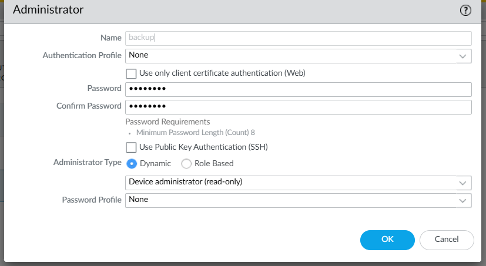
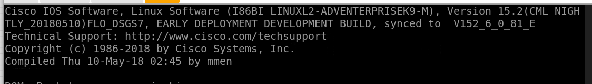
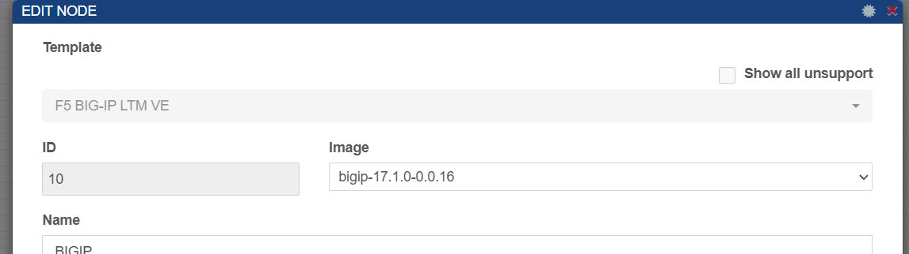
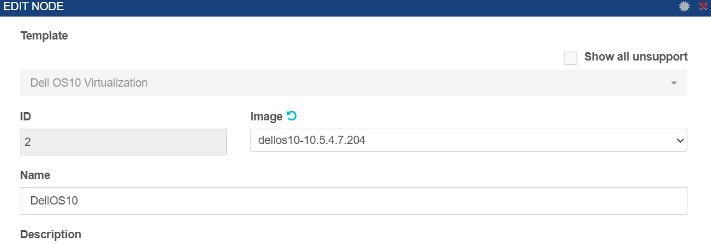

# Ansible-Backup


## Table of Contents
- [Introduction](#introduction)  
- [Topology](#topology)  
- [Steps](#steps)  
- [Device IP Address Table](#device-ip-address-table)  
- [Hosts Inventory](#hosts-inventory)  
- [Fortigate](#fortigate)  


## Introduction
I'm developing an Ansible-based backup automation project for firewalls (Fortinet, Palo Alto, F5) and network devices (Cisco switches and routers). The project includes a web interface to manage and monitor the automation process. Initially, I'm using PNetLab for simulation, with plans to transition to real-world scenarios for deployment and testing.


## Topology 


# Steps

### 🔹 **Phase 1: Environment Setup**  
- [ ] Set up **PNetLab** with firewall and network device images  
- [ ] Install **Ansible** and required dependencies  
- [ ] Configure SSH & API access for devices
- [ ] Configure  users on network devices  
- [ ] Define Ansible inventory for network devices  

### 🔹 **Phase 2: Backup Automation**  
- [ ] Create Ansible playbooks for:  
  - [ ] **Fortinet** backup  
  - [ ] **Palo Alto** backup  
  - [ ] **Cisco switches/routers** backup
  - [ ] **Dell switches/routers** backup
  - [ ] **F5** backup  
- [ ] Implement a  FTP  solution  
- [ ] Schedule automated backups
- [ ] password management

### 🔹 **Phase 3: Web Interface Development**  
- [ ] Design a **dashboard** for backup management  

### 🔹 **Phase 4: Testing & Real-World Deployment**  
- [ ] Validate automation in **PNetLab**  
- [ ] Deploy to real devices in a **test environment**


# Device IP Address Table  

| Device Type   | Vendor     | Hostname     | IP Address     |
|--------------|-----------|-------------|--------------|
| Firewall     | Fortinet   | FW1  | 192.168.11.190  |
| Firewall     | Palo Alto  | palo      | 192.168.11.160  |
| Firewall     | F5         | F5-LTM-1     | 192.168.11.170  |
| Switch       | Cisco      | SW   | 192.168.11.28 |
| Router       | Cisco      | R1           | 192.168.11.25 |
| Router       | Cisco      | R2           | 192.168.11.26 |
| Switch       | Dell      | dell1           | 192.168.11.166 |
| Server      | Ubuntu      | Control node           | 192.168.11.135 |
| Server      | Ubuntu      |  SFTP         |  192.168.11.165|


# Setting up Users on network devices 

## 1- Cisco User
```ini
crypto key generate rsa : 1024
ip ssh version 2
line vty 0 4
 login local
 transport input ssh
username souhail privilege 15 password 0 123

```


## 2- Fortigate User


```ini
Create a admin profile  (ansible ) with read & Write in the system access control 

```

```ini
Create a administrator (backup : ertdfgcvb ) with adminstrator profile ansible

```

## 3- Paloalto User


```ini
Create User 
# configure
# set mgt-config users <name> password
# set mgt-config users <name> permissions role-based devicereader
# commit
# exit
```


## 4- F5 User


```ini
Create Use back
> configure
# set mgt-config users <name> password
# set mgt-config users <name> permissions role-based devicereader
# commit
# exit
```


## 5- dell  User


```ini
Create Use back
> configure
# set mgt-config users <name> password
# set mgt-config users <name> permissions role-based devicereader
# commit
# exit
```


# Hosts inventory 
 

##  **📂** Playbook Location: `playbooks/hosts`**  

```ini
[routers]
R1 ansible_host=192.168.11.25
R2 ansible_host=192.168.11.26
[routers:vars]
ansible_user=souhail
ansible_password=123
ansible_connection=network_cli
ansible_network_os=ios


[switches]
SW2  ansible_host=192.168.11.28
[switches:vars]
ansible_user=souhail
ansible_password=123
ansible_connection=network_cli
ansible_network_os=ios


[fortigates]
fgt ansible_host=192.168.11.190  ansible_user=backup ansible_password=ertdfgcvb

[fortigates:vars]
ansible_network_os=fortinet.fortios.fortios
[all:vars]

ansible_connection=httpapi

ansible_httpapi_validate_certs=no

ansible_httpapi_use_ssl=no


[dell]
DEll1 ansible_host=192.168.11.166 ansible_net_os_name=dellos10

[dell:vars]
ansible_connection= ansible.netcommon.network_cli
ansible_network_os=dellemc.os10.os10
ansible_user= admin
ansible_password= ertdfgcvb
ansible_become= true
ansible_become_method= enable
ansible_become_password= !vault...

[paloAltos]
palo ansible_host=192.168.11.160  pa_rest_user=backup pa_rest_password=Palo@1234!

[paloAltos:vars]
ansible_connection=local
os=panos


[lb]
f5 inventory_host=192.168.11.170 inventory_user=backup_user inventory_pass=Big@1234! inventory_network_os=f5.bigip inventory_port=443


```

# Playbooks

## 1-  cisco 

### cisco  model


### **📂** Playbook Location: `playbooks/cisco.yml`**  


```yaml
---
- name: General Config for Routers
  hosts: routers
  gather_facts: true  
  vars:
    hostname: "{{ inventory_hostname }}"
  tasks:
    # - name: Add Banner
    #   cisco.ios.ios_banner:
    #     banner: login
    #     text: |
    #       Wasssssssssssuuuuuuuuuup
    #     state: present

    - name: Get timestamp
      command: date +%Y-%m-%d
      register: timestamp

    - name: Get router running config
      cisco.ios.ios_command:
        commands: show running-config
      register: router_config

    - name: Save config to local temp file
      ansible.builtin.copy:
        content: "{{ router_config.stdout[0] }}"
        dest: "/etc/ansible/cisco_folder/RT/{{ inventory_hostname }}_{{ timestamp.stdout }}.cfg"
      delegate_to: localhost

    - name: Copy file 
      shell: |
        sshpass -p "123" sftp souhail_backup@192.168.11.165 <<EOF
        put /etc/ansible/cisco_folder/RT/{{ inventory_hostname }}_{{ timestamp.stdout }}.cfg  /home/storage/backup/cisco/RT
        exit
        EOF
      no_log: true 


- name: Backup Switch Config 
  hosts: switches
  gather_facts: no

  tasks:
    - name: Get timestamp
      command: date +%Y-%m-%d
      register: timestamp
      delegate_to: localhost
    
    - name: Get switch running config
      cisco.ios.ios_command:
        commands: show running-config
      register: switch_config
    
    - name: Save config to local temp file
      ansible.builtin.copy:
        content: "{{ switch_config.stdout[0] }}"
        dest: "/etc/ansible/cisco_folder/SW/{{ inventory_hostname }}_{{ timestamp.stdout }}.cfg"
      delegate_to: localhost


    # - name: Copy file using sftp
    #   shell: |
    #     echo "put /tmp/{{ inventory_hostname }}_{{ timestamp.stdout }}.cfg /home/storage/backup/" | sftp souhail_backup@192.168.11.165

    - name: Copy file 
      shell: |
        sshpass -p "123" sftp souhail_backup@192.168.11.165 <<EOF
        put /etc/ansible/cisco_folder/SW/{{ inventory_hostname }}_{{ timestamp.stdout }}.cfg  /home/storage/backup/cisco/SW
        exit
        EOF
      no_log: true 
    
  
  
  
  


```


## 2-  fortigate 

### Firewall model


### **📂** Playbook Location: `playbooks/forti.yml`**  
```yaml
---
- name: General Config
  hosts: fortigates
  gather_facts: false
  collections:
    - fortinet.fortios

  vars:
    new_hostname: "fw1"
    vdom: "root"

  tasks:

    - name: Get timestamp
      command: date +%Y-%m-%d
      register: timestamp


    - name: Backup fortinet current config
      fortios_monitor_fact:
        vdom:  "{{ vdom }}"
        selector: 'system_config_backup'
        params:
          scope: "global"
      register: full_config


    - name: Save Full Configuration 
      copy:
        content: '{{ full_config.meta.raw  }}'
        dest: '/etc/ansible/forti_folder/{{inventory_hostname}}_{{ timestamp.stdout }}.cfg'


    - name: Copy file 
      shell: |
        sshpass -p "123" sftp souhail_backup@192.168.11.165 <<EOF
        put /etc/ansible/forti_folder/{{inventory_hostname}}_{{ timestamp.stdout }}.cfg  /home/storage/backup/forti
        exit
        EOF
      no_log: true 


```

## 3-  Palo Alto

### Firewall model


### Resources
[Playbook  Source](https://cs7networks.co.uk/2020/07/20/ansible-export-palo-alto-config/)


### **📂** Playbook Location: `playbooks/Palo.yml`**  
```yaml
---
- name: Export PA configs
  hosts: paloAltos
  connection: local
  gather_facts: no
  strategy: linear

  tasks:
    - name: Get timestamp
      command: date +%Y-%m-%d
      register: timestamp

    - name: Get REST API Key
      uri:
        validate_certs: no
        url: 'https://{{ ansible_host }}/api/?type=keygen&user={{ pa_rest_user }}&password={{ pa_rest_password }}'
        return_content: yes
        method: GET
      register: response_api_key

    - name: Read XML response
      xml: 
        content: 'text'
        xmlstring: '{{ response_api_key.content }}'
        xpath: '/response/result/key'
      register: api_key 

    - name: Gather config
      uri:
        validate_certs: no
        url: 'https://{{ ansible_host }}/api/?type=config&action=show&key={{ api_key.matches[0].key }}'
        return_content: yes
      register: response_pa_config

    - name: Save initial config
      copy:
        content: "{{ response_pa_config.content }}"
        dest: "/etc/ansible/palo_folder/{{ inventory_hostname }}_{{ timestamp.stdout }}.xml"

    - name: Remove unwanted closing tags
      replace:
        path: "/etc/ansible/palo_folder/{{ inventory_hostname }}_{{ timestamp.stdout }}.xml"
        regexp: '</result></response>'
        replace: ''

    - name: Remove extra newlines at end of file
      shell: |
        sed -i -e :a -e '/^\n*$/{$d;N;ba' -e '}' "/etc/ansible/palo_folder/{{ inventory_hostname }}_{{ timestamp.stdout }}.xml"

    - name: Copy file 
      shell: |
        sshpass -p "123" sftp souhail_backup@192.168.11.165 <<EOF
        put /etc/ansible/palo_folder/{{ inventory_hostname }}_{{ timestamp.stdout }}.xml  /home/storage/backup/palo
        exit
        EOF
      no_log: true 
```


##  4 - F5

### Firewall model



### **📂** Playbook Location: `playbooks/big.yml`**  
```yaml
---
- name: Create and Download UCS backup for F5 BIG-IP
  hosts: lb
  connection: local
  vars:
    backup_file_name: "{{ inventory_hostname }}-{{ ansible_date_time.date }}"
    provider:
      user: "{{ inventory_user }}"
      server: "{{ inventory_host }}"
      server_port: "{{ inventory_port }}"
      password: "{{ inventory_pass }}"
      transport: rest
      timeout: 600
      validate_certs: no
  gather_facts: true
  
  tasks:
    - name: Create a new UCS and Download
      f5networks.f5_modules.bigip_ucs_fetch:
        async_timeout: 1200
        src: "{{ backup_file_name }}.ucs"
        dest: "/etc/ansible/F5/{{ backup_file_name }}.ucs"
        create_on_missing: true
        only_create_file: false
        fail_on_missing: false
        provider: "{{ provider }}"
      delegate_to: localhost
      
    - name: Remove the UCS from the device
      f5networks.f5_modules.bigip_ucs:
        ucs: "{{ backup_file_name }}.ucs"
        state: absent
        provider: "{{ provider }}"
      delegate_to: localhost
      
    - name: Copy file 
      shell: |
        sshpass -p "123" sftp souhail_backup@192.168.11.165 <<EOF
        put /etc/ansible/F5/{{ backup_file_name }}.ucs  /home/storage/backup/
        exit
        EOF
      no_log: true 
```


##  5- dell

### switch model



### **📂** Playbook Location: `playbooks/big.yml`**  
```yaml
---
- name: Backup Dell OS10 Switch Configuration
  hosts: dell  
  gather_facts: no 

  tasks:
    - name: Get timestamp
      command: date +%Y-%m-%d
      register: timestamp

    - name: Backup current switch config (dellos10)
      dellemc.os10.os10_config:
        backup: yes
        backup_options:
          dir_path: "/etc/ansible/dell_folder"
          filename: "{{ inventory_hostname }}_{{ timestamp.stdout }}.cfg"
      register: backup_dellos10_location
      when: ansible_network_os == 'dellemc.os10.os10'

    - name: Display backup location
      debug:
        msg: "Backup stored at {{ backup_dellos10_location.backup_path }}"
      when: backup_dellos10_location.backup_path is defined


```


