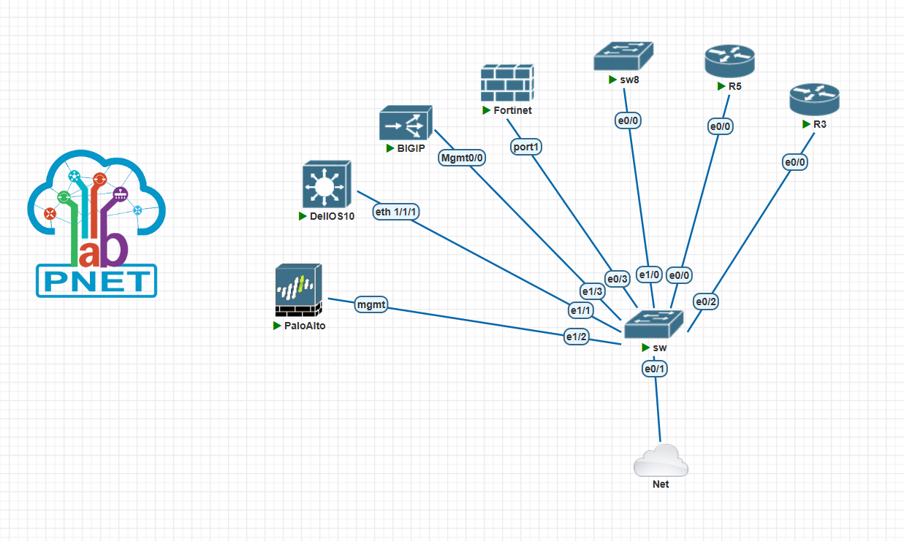
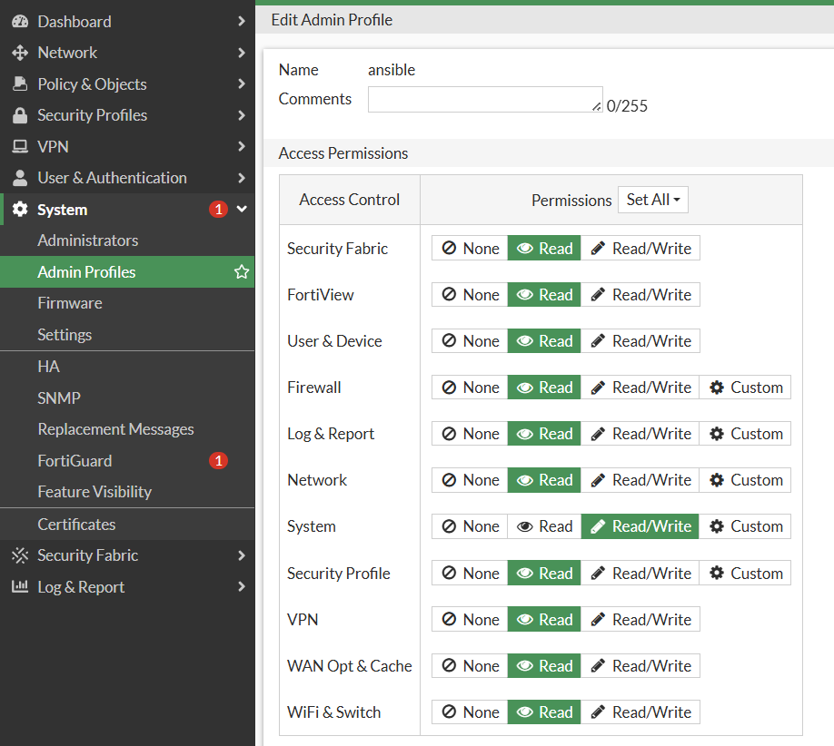
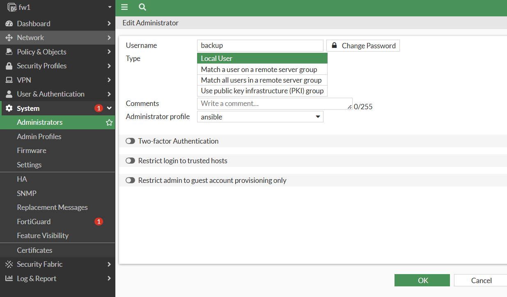
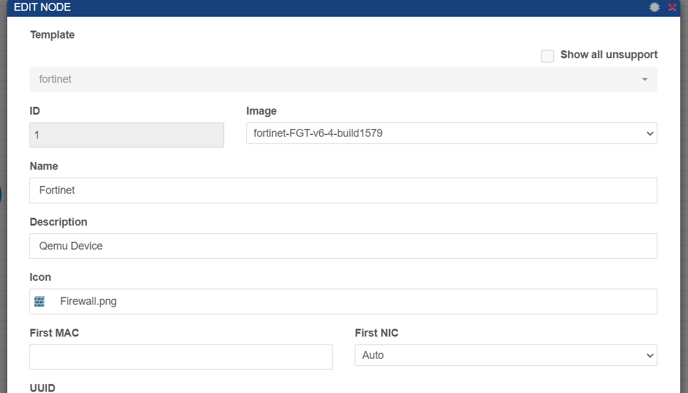

# Ansible-Backup


## Table of Contents
- [Introduction](#introduction)  
- [Topology](#topology)  
- [Steps](#steps)  
- [Device IP Address Table](#device-ip-address-table)  
- [Hosts Inventory](#hosts-inventory)  
- [Fortigate](#fortigate)  


## Introduction
I'm developing an Ansible-based backup automation project for firewalls (Fortinet, Palo Alto, F5) and network devices (Cisco switches and routers). The project includes a web interface to manage and monitor the automation process. Initially, I'm using PNetLab for simulation, with plans to transition to real-world scenarios for deployment and testing.


## Topology 



# Steps

### 🔹 **Phase 1: Environment Setup**  
- [ ] Set up **PNetLab** with firewall and network device images  
- [ ] Install **Ansible** and required dependencies  
- [ ] Configure SSH & API access for devices
- [ ] Configure  users on network devices  
- [ ] Define Ansible inventory for network devices  

### 🔹 **Phase 2: Backup Automation**  
- [ ] Create Ansible playbooks for:  
  - [ ] **Fortinet** backup  
  - [ ] **Palo Alto** backup  
  - [ ] **Cisco switches/routers** backup
  - [ ] **Dell switches/routers** backup
  - [ ] **F5** backup  
- [ ] Implement a  FTP  solution  
- [ ] Schedule automated backups
- [ ] password management

### 🔹 **Phase 3: Web Interface Development**  
- [ ] Design a **dashboard** for backup management  

### 🔹 **Phase 4: Testing & Real-World Deployment**  
- [ ] Validate automation in **PNetLab**  
- [ ] Deploy to real devices in a **test environment**


# Device IP Address Table  

| Device Type   | Vendor     | Hostname     | IP Address     |
|--------------|-----------|-------------|--------------|
| Firewall     | Fortinet   | FW1  | 192.168.11.190  |
| Firewall     | Palo Alto  | palo      | 192.168.11.160  |
| Firewall     | F5         | F5-LTM-1     | 192.168.11.170  |
| Switch       | Cisco      | SW   | 192.168.11.28 |
| Router       | Cisco      | R1           | 192.168.11.25 |
| Router       | Cisco      | R2           | 192.168.11.26 |
| Switch       | Dell      | dell1           | 192.168.11.166 |
| Server      | Ubuntu      | Control node           | 192.168.11.135 |
| Server      | Ubuntu      |  SFTP         |  192.168.11.165|


# Setting up Users on network devices 

## 1- Cisco User
```ini
crypto key generate rsa : 1024
ip ssh version 2
line vty 0 4
 login local
 transport input ssh
username souhail privilege 15 password 0 123

```


## 2- Fortigate User


```ini
Create a admin profile  (ansible ) with read & Write in the system access control 

```

```ini
Create a administrator (backup : ertdfgcvb ) with adminstrator profile ansible

```

## 3- Paloalto User


```ini
Create a admin profile  (ansible ) with read & Write in the system access control 

```

```ini
Create a administrator (backup : ertdfgcvb ) with adminstrator profile ansible

```


## Hosts inventory 
 

### **📂** Playbook Location: `playbooks/hosts`**  

```ini

[routers]
R1 ansible_host=192.168.11.25
R2 ansible_host=192.168.11.26
[routers:vars]
ansible_user=souhail
ansible_password=123
ansible_connection=network_cli
ansible_network_os=ios


[switches]
SW2  ansible_host=192.168.11.28
[switches:vars]
ansible_user=souhail
ansible_password=123
ansible_connection=network_cli
ansible_network_os=ios


[fortigates]
fgt ansible_host=192.168.11.66 ansible_user=admin ansible_password=ertdfgcvb

[fortigates:vars]
ansible_network_os=fortinet.fortios.fortios
[all:vars]

ansible_connection=httpapi

ansible_httpapi_validate_certs=no

ansible_httpapi_use_ssl=no


[dell]
DEll1 ansible_host=192.168.11.152 ansible_net_os_name=dellos10

[dell:vars]
ansible_connection= ansible.netcommon.network_cli
ansible_network_os= dellemc.os10.os101
ansible_user= admin
ansible_password= ertdfgcvb
ansible_become= true
ansible_become_method= enable
ansible_become_password= !vault...

[paloAltos]
palo ansible_host=192.168.11.160

[paloAltos:vars]
ansible_connection=local
os=panos


```


##  fortigate 

### Firewall model



### **📂** Playbook Location: `playbooks/forti.yml`**  
```yaml
---
- name: General Config
  hosts: fortigates
  gather_facts: true
  collections:
    - fortinet.fortios

  vars:
    new_hostname: "fw1"
    vdom: "root"

  tasks:

    - name: Get timestamp
      command: date +%Y-%m-%d
      register: timestamp


    - name: Backup fortinet current config
      fortios_monitor_fact:
        vdom:  "{{ vdom }}"
        selector: 'system_config_backup'
        params:
          scope: "global"
      register: full_config


    - name: Save Full Configuration 
      copy:
        content: '{{ full_config.meta.raw  }}'
        dest: '/etc/ansible/forti_folder/{{inventory_hostname}}_{{ ansible_date_time.date }}.cfg'


```


